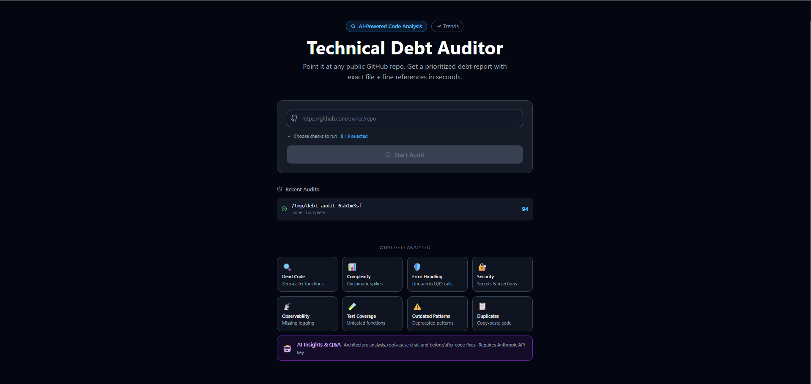
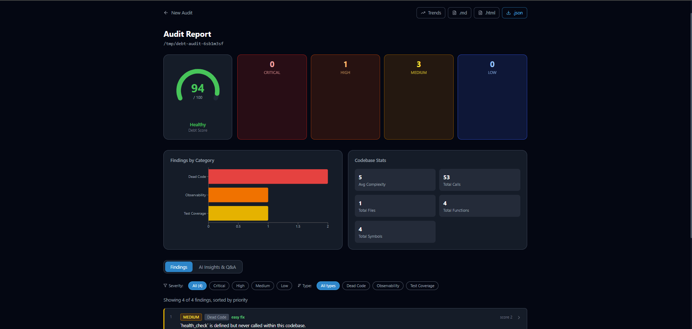
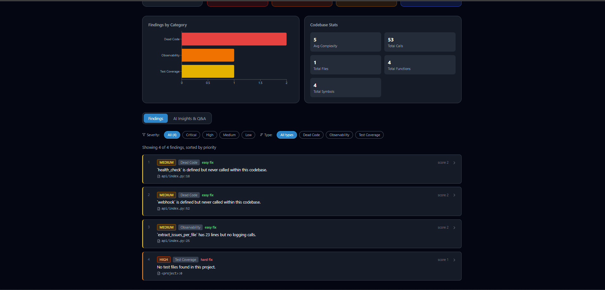
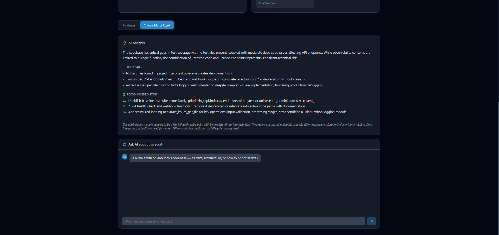

# AI Technical Debt Auditor

> Point it at any public GitHub repository. Get a prioritized technical debt report with exact file + line references in seconds — powered by static analysis and Claude AI.

[](LICENSE)
[](https://www.python.org/)
[](https://react.dev/)
[](CONTRIBUTING.md)

**Live demo:** https://debt-auditor-ui.onrender.com

---

## What it does

Paste a GitHub URL → the auditor clones the repo, runs 8 static analysis checkers and optional AI insights, and returns a scored report showing every debt item with its file, line number, severity, and a concrete fix suggestion.

No local installation needed to use the demo. Self-host in minutes with the setup guide below.

---

## Features

### 8 Static Checkers — no API key required

| Checker | What it finds |
|---|---|
| 🔍 **Dead Code** | Public functions with zero callers in the call graph |
| 📊 **Complexity** | Cyclomatic complexity above threshold (default: 10) |
| 🛡️ **Error Handling** | I/O and network calls not wrapped in try/except |
| 🔐 **Security** | Hardcoded secrets, `eval()`/`exec()`, `pickle.loads()`, SQL injection via string formatting |
| 📡 **Observability** | Functions ≥ 8 lines with no logging, silent except blocks |
| 🧪 **Test Coverage** | Public functions with no reference in any test file |
| ⚠️ **Outdated Patterns** | Mutable default args, `type() ==`, `%` string formatting, old-style `super()` |
| 📋 **Duplicates** | Near-identical code blocks detected via Jaccard similarity on token bigrams |

### AI Layer — requires Anthropic API key (bring your own)

| Feature | What it does |
|---|---|
| 🤖 **AI Insights** | Architecture-level summary of the top debt patterns |
| 💬 **Q&A Chat** | Ask free-form questions about the codebase debt |
| ✨ **AI Fix** | Before/after code fix for any individual finding |

The API key is entered in the UI, stored only in your browser, and never saved on the server.

### Report & Export

- **Debt score** (0–100) with a visual gauge
- **Category breakdown** chart
- Filter by severity (critical / high / medium / low) or checker type
- Export as **JSON**, **Markdown**, or **HTML**
- **Trends** page — track debt score over time across audits

---

## Screenshots

**Home — choose your checks**


**Audit Report — scored findings with file + line references**



**AI Insights & Q&A — architecture analysis + chat**


---

## Self-hosting

### Prerequisites

- Python 3.11+
- Node.js 18+
- Git

### 1 — Clone and install

```bash
git clone https://github.com/Prashant-Bhapkar/AI-Technical-Debt-Auditor.git
cd AI-Technical-Debt-Auditor

# Backend
python -m venv venv
source venv/bin/activate      # Windows: venv\Scripts\activate
pip install -r requirements.txt

# Frontend
cd frontend && npm install && cd ..
```

### 2 — Configure environment (optional)

```bash
cp .env.example .env
# Edit .env and set ANTHROPIC_API_KEY=sk-ant-...
# This is a server-side fallback — users can also supply their own key in the UI
```

### 3 — Run

**Terminal 1 — Backend:**
```bash
python run_backend.py
# Flask on http://localhost:5000
```

**Terminal 2 — Frontend:**
```bash
cd frontend
npm run dev
# Vite on http://localhost:3000
```

Open http://localhost:3000 and paste any public GitHub URL.

---

## Deploy to Render (free)

The fastest way to get a public URL without a credit card.

### Backend (Web Service)

| Field | Value |
|---|---|
| Runtime | Python 3 |
| Build Command | `pip install -r requirements.txt` |
| Start Command | `python run_backend.py` |
| Instance Type | Free |
| Env var | `FLASK_DEBUG=false` |

### Frontend (Static Site)

| Field | Value |
|---|---|
| Build Command | `cd frontend && npm ci && npm run build` |
| Publish Directory | `frontend/dist` |
| Env var | `VITE_API_URL=<your-backend-url.onrender.com>` |

Add a rewrite rule: `/*` → `/index.html` (handles React Router).

### Custom Domain

Point a CNAME record (`audit.yourdomain.com`) to your Render static site URL, then add the custom domain in the Render dashboard. SSL is provisioned automatically.

---

## Project Structure

```
AI-Technical-Debt-Auditor/
├── backend/
│   ├── core/
│   │   ├── indexer.py          # tree-sitter → SQLite call graph
│   │   ├── graph.py            # call graph SQL queries
│   │   ├── prioritizer.py      # severity × effort → priority score + debt score
│   │   ├── ai_analyzer.py      # Anthropic API: insights, Q&A, fix generation
│   │   ├── audit_history.py    # SQLite persistent history (~/.debt-auditor/)
│   │   └── checkers/
│   │       ├── __init__.py         # Finding dataclass
│   │       ├── dead_code.py
│   │       ├── complexity.py
│   │       ├── error_handling.py
│   │       ├── security.py
│   │       ├── observability.py
│   │       ├── test_coverage.py
│   │       ├── outdated_patterns.py
│   │       └── duplicates.py
│   ├── reporters/
│   │   ├── html_report.py      # self-contained HTML export
│   │   └── markdown_report.py  # Markdown export
│   ├── routes/
│   │   ├── audit_routes.py     # /api/audit/*
│   │   ├── qa_routes.py        # /api/qa/*
│   │   └── report_routes.py    # /api/report/*, /api/history
│   ├── app.py                  # Flask factory
│   └── config.py
├── frontend/
│   └── src/
│       ├── pages/
│       │   ├── Home.tsx
│       │   ├── AuditReport.tsx
│       │   └── Trends.tsx
│       ├── components/
│       │   ├── ApiKeyBar.tsx
│       │   ├── FindingCard.tsx
│       │   ├── DebtScoreGauge.tsx
│       │   ├── CategoryBreakdown.tsx
│       │   ├── AIInsightsPanel.tsx
│       │   └── QAChat.tsx
│       └── api/client.ts
├── render.yaml                 # Render Blueprint (optional)
├── run_backend.py
├── requirements.txt
└── .env.example
```

---

## REST API

```
POST /api/audit/start           { repo_url, checkers[] }  →  { audit_id }
GET  /api/audit/status/:id      →  { status, progress, phase }
GET  /api/audit/result/:id      →  { score, findings[], summary, ai_insights }
GET  /api/audit/list            →  { audits[] }

POST /api/qa/ask                { audit_id, question }  →  { answer }
POST /api/qa/fix                { finding }  →  { before, after, explanation }

GET  /api/report/:id/html       →  HTML file download
GET  /api/report/:id/markdown   →  Markdown file download
GET  /api/history               →  { history[] }

GET  /api/health                →  { status, version }
```

---

## Adding a New Checker

1. Create `backend/core/checkers/my_checker.py` with a `check(db_path, source_root) -> list[Finding]` function
2. Add `"my_checker"` to `_ALL_CHECKERS` in `audit_routes.py` and call it inside `_run_audit`
3. Add the entry to `STATIC_CHECKERS` in `frontend/src/pages/Home.tsx`

See [CONTRIBUTING.md](CONTRIBUTING.md) for the full guide with a code template.

---

## Roadmap

These features are planned or open for contribution:

### Repository Support
- [ ] **GitHub private repos** — authenticate with a personal access token (PAT) supplied in the UI
- [ ] **GitLab public repos** — clone via GitLab API
- [ ] **GitLab private repos** — authenticate with GitLab PAT
- [ ] **Bitbucket repos** — public and private
- [ ] **Azure DevOps repos**

### Language Support
- [ ] **JavaScript / TypeScript** — extend tree-sitter indexer
- [ ] **Java** — dead code, complexity, error handling
- [ ] **Go** — error handling patterns (`if err != nil`)
- [ ] **Rust** — unwrap() usage, complexity

### Integrations
- [ ] **GitHub Actions bot** — comment findings on PRs automatically
- [ ] **VS Code extension** — inline debt annotations in the editor
- [ ] **Slack / Discord notifications** — alert on score drops
- [ ] **Scheduled recurring audits** — cron-based monitoring with trend alerts

### Analysis
- [ ] **Audit diff view** — compare two runs, show what improved or regressed
- [ ] **Custom thresholds** — configure complexity limit, duplicate similarity, etc.
- [ ] **Dependency audit** — outdated packages, known CVEs
- [ ] **README badge** — embed live debt score in your own repo's README

### Platform
- [ ] **Team workspaces** — shared audit history across a team
- [ ] **Public shareable reports** — permalink to a specific audit result
- [ ] **Self-hosted Docker image** — single `docker run` setup

---

## Tech Stack

| Layer | Technology |
|---|---|
| Backend | Python 3.11 · Flask · tree-sitter · SQLite · GitPython |
| AI | Anthropic Claude (`claude-haiku-4-5`) |
| Frontend | React 18 · TypeScript · Tailwind CSS · React Query · Recharts |
| Build | Vite · npm |
| Deploy | Render (backend Web Service + frontend Static Site) |

---

## Contributing

Contributions of all kinds are welcome — new checkers, bug fixes, new language support, UI improvements, or documentation.

See [CONTRIBUTING.md](CONTRIBUTING.md) to get started.

---

## License

[MIT](LICENSE) © 2026 [Prashant Bhapkar](https://prashantbhapkar.com)
